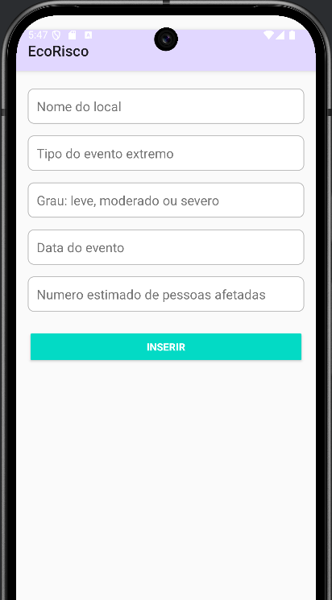
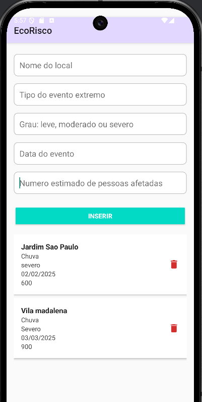

# EcoRisco

1. [Alunos](#alunos)
2. [Sobre](#sobre)
3. [Estrutura](#estrutura)

## Alunos

- Jamilli Vitória Gioielli - RM 552414
- Wendel de Oliveira Silvestre - RM 552263

## Sobre

O projeto EcoRisco é uma aplicação Android criada para cadastrar eventos extremos ocorridos em diferentes regiões.

A página inicial da aplicação apresenta um formulário de cadastramento de eventos, solicitando as seguintes informações: 

- Nome do local
- Tipo do evento extremo (chuva intensa, seca, onda de calor, etc.)
- Grau de impacto (leve, moderado, severo)
- Data do evento 
- Número estimado de pessoas afetadas

Esses dados são exibidos em uma lista, na qual é possível excluir eventos.

## Estrutura

O projeto foi construído com o Android 35, utilizando o Gradle como compilador e o Java 21.